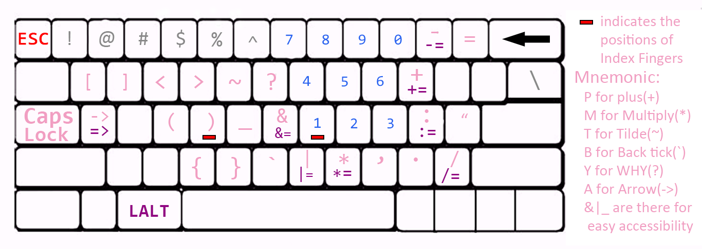
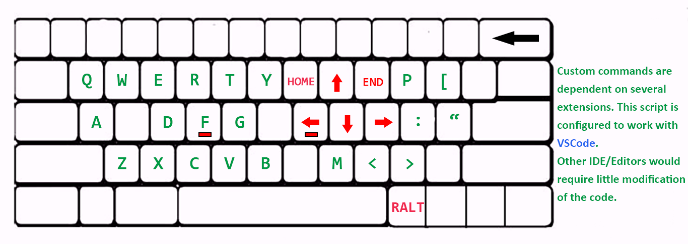

# Keyboard-Mapping-Optimized-10x-Developer-Edition

An **[AutoHotKey](https://www.autohotkey.com/docs/misc/Remap.htm)** script that optimizes keymap for **programming** usage.

The script enables the **CapsLock** and **Right ALT** key functioning like the modifier keys(*e.g. ctrl, shift*).You'll be using ur most **flexible** fingers to type some of the most **used** keys(symbols/operators/arrow keys) in the most **convenient** location, whereas inb4 typing symbols and brackets relies on Right **Pinky** too much and often require **distant** hand movements(ahh...). Using the script to 10x your privilege and joy while coding. 

>but if ur looking for 100x privilege and pride please use VIM instead =))

## USAGE 
### CapsLock Layer: Operators and Numbers


CapsLock + keys: send **operators** and **numbers** (pink and blue ones)  
CapsLock + LALT + keys: send **assignment operators** (purple ones) 

**Double-tap CapsLock** to turn CAPITALIZATION ON/OFF(the key's original functionality). (or if you prefer Double-tap to turn it on and single tab to turn it off then just commenting off/on the corresponding code section)
___

### RALT Layer: Navigation and Custom Commands


RALT + keys: send **arrow keys**(red) and **custom commands**(Green)
```autohotkey
; Required extensions for VSCode: (don't bother if you won't use the following custom commands) 
;"Bracket Select" publisher:"Chunsen Wang"
;"Quick and Simple Text Selection" publisher:"David Bankier" 
;"change-case" publisher:"wmaurer"
;"Go to Next/Previous Member" publisher:"Mishkin Faustini"
;"Any Swap" by publisher:"wolray"
;"Copy word in cursor" publisher:"Alessandro Fragnani"
;"Semicolon Insertion Shortcut" publisher:"Christian Valentin"
;"Multiple clipboards for VSCode" publisher:"slevesque"
;"Code Ace Jumper" publisher:"lucax88x"

RALT + E  ;select inside angled brackets ! "Quick and Simple Text Selection" (extension.selectAngleBrackets)
RALT + H  ;select inside HTML tag ! "Quick and Simple Text Selection" (extension.selectInTag)
RALT + [  ;select inside square/curly bracket ! "Quick and Simple Text Selection" (extension.selectSquareBrackets)
RALT + '  ;switch quotes ! "Quick and Simple Text Selection" (extension.switchQuotes)
RALT + F  ;(Flip case) flip word to lower/upper/camel/firstUpper case !"change-case" (extension.changeCase.lower, extension.changeCase.upper, extension.changeCase.upperFirst)
RALT + .  ;swap argument right !"Any Swap" (anySwap.forward)
RALT + ,  ;swap argument left (anySwap.Backward)
RALT + Q  ;(Quote) select the content inside quote/bracket, press again to expand selection !"Bracket Select" (bracket-select.select)
RALT + M  ;(Member) jump to next/previous Member/Method !"Go to Next/Previous Member" (gotoNextPreviousMember.nextMember, gotoNextPreviousMember.previousMember)
RALT + W  ;(Word) select word, press again to select next occurrence
RALT + C  ;(Copy) copy the word in cursor location ! "copy word in cursor" 
RALT + X  ;(X) cut word/selection !need above extension
RALT + V  ;(V) Paste 
RALT + R  ;(Replace) replace Word with the clipboard
RALT + Z  ;(Z) undo
RALT + Y  ;(Y) redo
RALT + T  ;(Text) select all Text in line (excluding the indent)
RALT + A  ;(All) select all thing in a line including the indent
RALT + D  ;(Delete) word 
RALT + ;  ;add ;/: at end of line !"Semicolon Insertion Shortcut"
RALT + G  ;(Goto) go to word, RALT+SHIFT+G go to line !"ACE Jumper"
RALT + B  ;(Board) clipboard buffer
RALT + P  ;(Page) scroll page up, RALT+LALT+P scrolls page down 
```
___

*Remember to run the script as **administrator**  otherwise the script won't function on programs with elevated privilege. You could also set up a scheduled task to automatically start the script(.exe file) at system startup.
